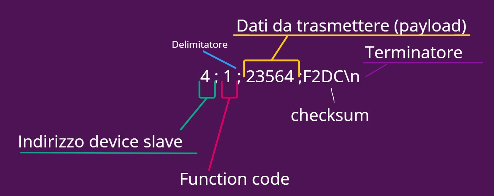

# A2_project_work
Project work of the second year of ITS.

## Simulator and boards
PICSimLab - PICGenios
PIC16F877A

## Protocollo custom

### Architettura

Master - slave, il master "pinga" i singoli dispositivi presenti sulla rete uno a uno tramite il loro indirizzo.

### Messaggio tipico

### Codici funzione

| Codice |           Inviato da Master           |        Inviato da Slave         |             Payload              |                           Note                            |
| :----: | :-----------------------------------: | :-----------------------------: | :------------------------------: | :-------------------------------------------------------: |
|  '1'   | ping/keepalive/check "novità" a slave |                /                |                /                 |        Rasp cicla tutti i pic, verifica richiesta         |
|  '2'   |                   /                   |            keepalive            |                /                 |           Risposta a 1 "non è successo niente"            |
|  '3'   |                   /                   | Richiesta codice autenticazione |                /                 | Risposta a 1 "schiacciato pulsante per richiedere codice" |
|  '4'   |      Invio codice autenticazione      |                /                |       codiceAutenticazione       |                  Risposta a 3 con codice                  |
|  '5'   |                   /                   |  Invia codice sblocco inserito  |      codiceSbloccoInserito       |   Risposta a 1 "utente a inserito un codice di sblocco"   |
|  '6'   |         Invio esito negativo          |                /                | tentativiRimanenti / t (timeout) |                                                           |
|  '7'   |         Invio esito positivo          |                /                |                /                 |                      Risposta 1 apri                      |

